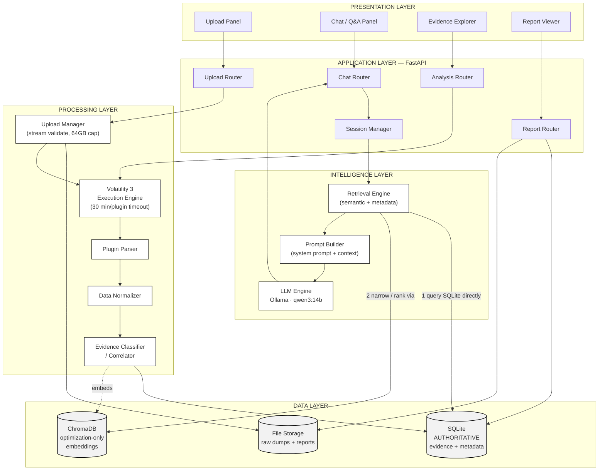

# FIA (Anveshak)

**AI-powered memory forensic investigation, grounded in evidence — not guesswork.**

A single Volatility 3 sweep against a memory image produces thousands of disconnected rows: process lists, sockets, loaded modules, registry keys, injected memory regions — none of them referencing one another. FIA pairs Volatility 3 with a locally-hosted language model (Ollama, `qwen3:14b`) to turn that raw output into a conversational investigation: upload a dump, let the plugin sweep run unattended, then ask questions in plain language and get answers that cite the specific plugin and artifact behind every claim. If there's no supporting evidence, it says so explicitly instead of guessing.

## Key Features

Reflects what's actually implemented today — see [`docs/04_Development_Status_and_Roadmap.md`](docs/04_Development_Status_and_Roadmap.md) for the full, current status table.

- **Automated Volatility 3 execution** — the full configured plugin set runs unattended against an uploaded dump, with each plugin isolated under its own timeout so one failure or hang never aborts the rest of the run
- **Unified evidence schema** — heterogeneous plugin output (processes, DLLs, network connections, registry keys, injected memory, files, handles) is parsed and normalized into one consistent, queryable structure
- **Evidence classification & cross-plugin correlation** — related artifacts (e.g. a process, the DLLs it loaded, and the connections it opened) are linked automatically, not left as isolated facts
- **SQLite-authoritative retrieval with semantic search** — ChromaDB accelerates lookup, but SQLite is the system of record, so a vector-index miss can never silently masquerade as "no evidence exists"
- **Evidence-grounded chat** *(in progress — verified against real evidence, not yet against a real Volatility-analyzed dump)* — natural-language Q&A that cites its sources by plugin and artifact, and explicitly refuses to answer when nothing relevant was found
- **Streamed, bounded-memory upload handling** — dumps up to 64 GB are validated and hashed incrementally as they arrive, never buffered fully in memory
- **PDF investigation reporting** *(in progress)*
- **Fully local execution** — forensic processing and LLM inference both run on-machine, with no external network dependency

## Tech Stack

| Layer | Technology |
|---|---|
| Backend | Python, FastAPI |
| Frontend | React, Vite, TypeScript, Tailwind CSS |
| Memory forensics | Volatility 3 |
| LLM runtime | Ollama, running `qwen3:14b` locally |
| Metadata store | SQLite (authoritative evidence store) |
| Vector store | ChromaDB (retrieval optimization only, rebuildable) |
| Reporting | ReportLab / Jinja2 |

## Architecture



SQLite is the authoritative evidence store, not ChromaDB — a deliberate departure from a default RAG design, made specifically so a vector-index miss can never silently read as "no evidence exists." Full rationale in [`docs/02_System_Architecture_and_Design.md`](docs/02_System_Architecture_and_Design.md).

## Quick Start

Prerequisites: Python 3.10+, Node.js 18+, [Ollama](https://ollama.com) installed and running.

**1. Clone and pull the model**

```bash
git clone <repo-url> FIA
cd FIA
ollama pull qwen3:14b
```

**2. Backend setup**

```bash
cd backend
python -m venv .venv

# activate — pick the one for your shell
source .venv/Scripts/activate      # Git Bash / WSL on Windows
.venv\Scripts\Activate.ps1         # PowerShell
.venv\Scripts\activate.bat         # cmd.exe

pip install -r requirements.txt
```

> **Always activate the venv before starting the backend.** Volatility's `vol` executable is installed into `.venv/Scripts/` — if you run the venv's `python.exe` by direct path instead of activating first, `vol` won't resolve on `PATH` and plugin execution will fail. Details in [`docs/02_System_Architecture_and_Design.md`](docs/02_System_Architecture_and_Design.md), §9.

**3. Configure environment**

Copy `backend/.env.example` to `backend/.env` and fill in values matching `backend/configs/config.yaml`:

```env
APP_NAME=AI Memory Forensic Investigation Assistant
APP_VERSION=1.0.0
ENVIRONMENT=development
HOST=127.0.0.1
PORT=8000

DATABASE_PATH=storage/database/fia.db
VECTOR_DB_PATH=storage/vectors

LOG_LEVEL=INFO
LOGGING_CONFIG_PATH=configs/logging.yaml

REPORT_DIRECTORY=storage/reports

OLLAMA_HOST=http://localhost:11434
LLM_MODEL=qwen3:14b
LLM_TEMPERATURE=0.0
LLM_CONTEXT_WINDOW=8192
LLM_TIMEOUT=120
```

**4. Run the backend**

```bash
# from backend/, with the venv still activated
python -m uvicorn app.main:app --host 127.0.0.1 --port 8000
```

Check it booted correctly: `curl http://127.0.0.1:8000/health`

**5. Run the frontend**

```bash
cd frontend
npm install
npm run dev
```

The dashboard is served at `http://localhost:5173` and talks to the backend at `http://127.0.0.1:8000` by default (override with `VITE_API_URL`).

## Current Status

The core pipeline — upload, Volatility execution, parsing, normalization, evidence storage, classification, and retrieval — is built and test-covered (147/147 automated tests passing). Chat has been verified end-to-end against real evidence in the database, including citations and history persistence, but **a real memory dump has not yet been carried through the full pipeline** — every run to date has used a placeholder file or pre-existing test-fixture evidence. That's the current gating milestone before further feature work.

Full status table, known issues, and priority order: [`docs/04_Development_Status_and_Roadmap.md`](docs/04_Development_Status_and_Roadmap.md).

## Documentation

| Document | Covers |
|---|---|
| [`docs/01_Software_Requirements_Specification.md`](docs/01_Software_Requirements_Specification.md) | Problem statement, objectives, users, functional/non-functional requirements |
| [`docs/02_System_Architecture_and_Design.md`](docs/02_System_Architecture_and_Design.md) | System architecture, module design, tech stack, operational limits |
| [`docs/03_Data_Model_API_and_Prompt_Reference.md`](docs/03_Data_Model_API_and_Prompt_Reference.md) | Evidence schema, entity relationships, API surface, the exact LLM prompt contract |
| [`docs/04_Development_Status_and_Roadmap.md`](docs/04_Development_Status_and_Roadmap.md) | What's done, what's in progress, known issues, priority order, roadmap |
| [`docs/ENGINEERING_LOG.md`](docs/ENGINEERING_LOG.md) | Day-by-day development history, built from git history |

## License & Contributing

No license file is currently included — this is an internal/internship project and not yet published for external use or contribution.
