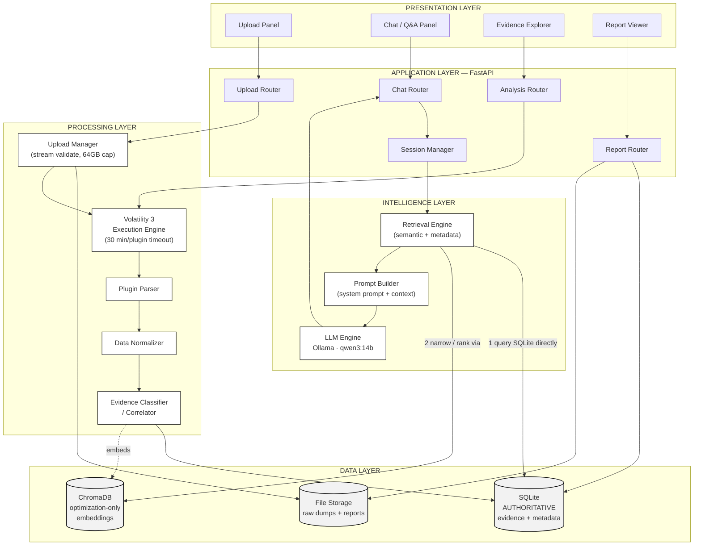
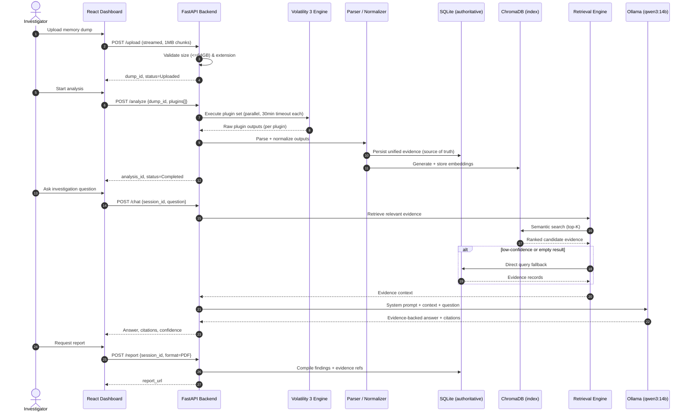

# System Architecture & Design

**FIA (Anveshak) — As-Built Architecture, Module Design & Identified Improvements**

| | | | |
|---|---|---|---|
| **Document Code** | FIA-ARC-02 | **Version** | 2.0 |
| **Status** | Active | **Date** | August 2026 |
| **Prepared By** | Project Intern | **Reviewed By** | Project Mentor |

---

## 1. Architectural Approach

FIA is built as a layered pipeline: forensic execution is fully decoupled from AI reasoning, and both are decoupled from presentation. The governing design decision is where the evidence "source of truth" lives — and it lives in SQLite, not in the vector store. This is a deliberate departure from a common RAG default (treating the vector index as primary) and it exists specifically to prevent the retrieval layer from becoming a silent point of data loss.

### 1.1 Why SQLite Is Authoritative, Not ChromaDB

A vector index is a derived artifact: it can be rebuilt from source data at any time, but it can also drift, go stale, or simply return nothing for a query that has a perfectly good answer sitting in structured storage. Treating it as the system of record means a bad embedding, an unindexed record, or a similarity-search miss silently becomes "no evidence exists," which is exactly the failure mode this platform cannot afford. SQLite is written first and durably; ChromaDB is built from it purely to make semantic search fast, and can fall out of sync or be rebuilt without any loss of evidence.

## 2. System Architecture

*Figure 1. Layered system architecture. Solid arrows are the write/execution path; the retrieval engine reads SQLite directly as a fallback when the vector search is inconclusive.*

### 2.1 Layer Responsibilities

| Layer | Responsibility | Key Components |
|---|---|---|
| Presentation | Upload, chat, evidence browsing, report viewing | React + Vite dashboard |
| Application | Routing, session state, request orchestration | FastAPI routers, Session Manager |
| Processing | Run Volatility, parse, normalize, correlate | Upload Manager, Execution Engine, Parser, Normalizer, Evidence Classifier |
| Intelligence | Retrieve evidence, build prompts, generate answers | Retrieval Engine, Prompt Builder, LLM Engine |
| Data | Durable storage and fast retrieval index | SQLite (authoritative), ChromaDB (index), file storage |

## 3. End-to-End Investigation Flow

*Figure 2. Sequence of operations from upload through chat to report generation, including the retrieval fallback path.*

### 3.1 Notable Design Points

- Upload validation happens during the stream itself — an oversized file is rejected mid-transfer, not after landing fully on disk.
- Plugins execute independently with their own timeout; one hung or failing plugin does not abort the rest of the analysis.
- Retrieval tries the vector index first for speed, and falls back to a direct SQLite query when confidence is low or results are empty — the investigator never sees "no evidence" because an index happened to miss it.
- The LLM only ever sees evidence that was actually retrieved; it has no path to answer from general knowledge.

## 4. Technology Stack

| Layer | Technology | Notes |
|---|---|---|
| Backend | Python, FastAPI | — |
| Frontend | React, Vite, TypeScript, Tailwind CSS | Chosen in place of the originally planned Streamlit UI |
| Memory forensics | Volatility 3 | — |
| LLM runtime | Ollama, running qwen3:14b locally | No cloud dependency |
| Metadata store | SQLite | Authoritative evidence store |
| Vector store | ChromaDB | Retrieval optimization only, rebuildable |
| Reporting | ReportLab / Jinja2 | — |

> The originally planned LangChain/LlamaIndex orchestration layer is not used in the current implementation — the system talks to Ollama directly. This is simpler to reason about and debug, and is retained as a deliberate choice rather than an omission.

## 5. Module Design

### 5.1 Upload Manager

Streams the incoming file in fixed-size chunks, checking cumulative size against the 64 GB cap and validating the file extension as data arrives — rejecting and discarding a bad upload before it fully lands on disk, rather than after.

### 5.2 Volatility Execution Engine

Runs each configured plugin as an isolated subprocess with a 30-minute timeout. A timeout or crash is captured as a per-plugin failure and logged; it does not halt the remaining plugin queue.

### 5.3 Plugin Parser & Data Normalizer

Converts each plugin's raw output format into the shared evidence schema described in the Data Model document, resolving naming differences between plugins and discarding malformed rows rather than propagating them downstream.

### 5.4 Evidence Classifier / Correlator

Links related evidence across plugins — for example, associating a process record with the DLLs it loaded and the connections it opened — so that a single query can surface a coherent picture instead of isolated facts. This capability was originally scoped for a later release and is already implemented.

### 5.5 Retrieval Engine

Performs semantic search against ChromaDB first; when confidence is low or results are empty, queries SQLite directly using structured filters (plugin, entity type, keyword match) as a fallback before returning "no evidence found."

### 5.6 Prompt Builder & LLM Engine

Combines the system prompt, the retrieved evidence, and the investigator's question into a single bounded prompt, then sends it to Ollama. The full prompt contract is defined in `03_Data_Model_API_and_Prompt_Reference.md`.

## 6. Module Implementation Status

| Module | Status |
|---|---|
| Upload Manager | ✅ Done |
| Volatility Execution Engine | ✅ Done |
| Plugin Parser | ✅ Done |
| Data Normalizer | ✅ Done |
| Evidence Store (SQLite) | ✅ Done |
| Vector Index (ChromaDB) | ✅ Done |
| Evidence Classifier / Correlator | ✅ Done |
| Retrieval Engine | ✅ Done |
| Prompt Builder | ✅ Done |
| LLM Engine (Ollama) | ✅ Done |
| Chat UI — backend wiring | 🔶 In Progress |
| Report Generator | 🔶 In Progress |
| Verified real-dump run | ⬜ Not Started |

## 7. Operational Limits

| Limit | Value |
|---|---|
| Maximum upload size | 64 GB (hard cap, enforced during streamed upload) |
| Accepted extensions | .raw, .mem, .bin, .dmp, .img |
| Per-plugin execution timeout | 30 minutes (subprocess-level, not whole-investigation) |
| Timeout configurability | None yet — hardcoded constant (see §8.3) |

## 8. Identified Improvements

The following were identified during architecture review and are recommended for the next development cycle. None are implemented yet.

1. Version the API surface (`/api/v1`) now, before external consumers exist and versioning becomes disruptive to retrofit.
2. Stop tracking the live SQLite and ChromaDB database files in version control — they hold real evidence data and risk both repo bloat and accidental sensitive-data commits.
3. Move the plugin execution timeout from a hardcoded constant into `config.yaml` so it can be tuned per deployment without a code change.
4. Add a lightweight health/readiness endpoint so the frontend can detect backend and Ollama availability before accepting an upload.
5. Once real timing data exists from a full end-to-end run, evaluate moving long-running analyses to a background task queue rather than a blocking request.

## 9. Known Operational Issue

The Volatility CLI binary is only resolvable on PATH when the backend's Python virtual environment is activated. Starting the server by invoking the venv's interpreter directly, without activation, breaks plugin execution silently. **The virtual environment must always be activated before starting the backend.**

## 10. Security Posture

- All processing is local; no evidence leaves the machine
- Raw plugin output is treated as read-only and never modified in place
- Authentication and role-based access are intentionally out of scope for the current phase
- Audit logging of investigation actions is planned but not yet implemented

## 11. Deployment Model

Current deployment is single-machine and local-first: FastAPI, SQLite, ChromaDB, and Ollama all run on the same host. A hybrid or cloud deployment mode remains a reasonable future direction but is not implemented, and no part of the current design should be assumed to work under a distributed topology without further work.
