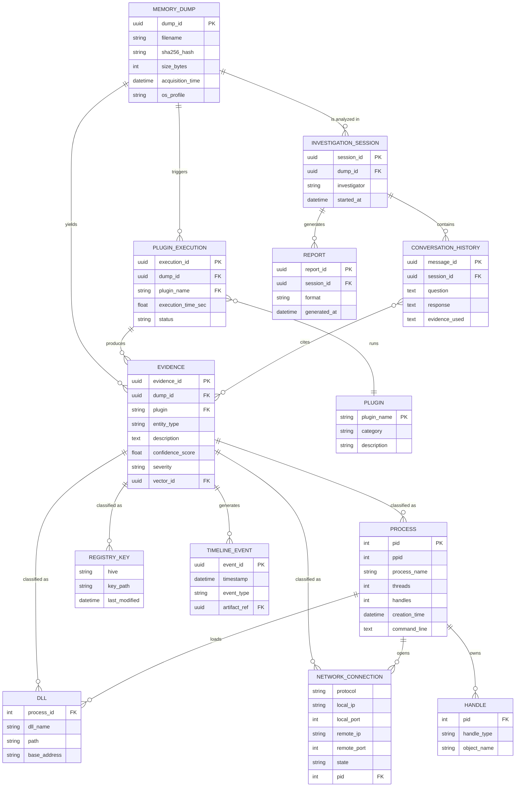

# Data Model, API & Prompt Reference

**FIA (Anveshak) — Evidence Schema, REST Interfaces & AI Prompt Contract**

| | | | |
|---|---|---|---|
| **Document Code** | FIA-API-03 | **Version** | 2.0 |
| **Status** | Active | **Date** | August 2026 |
| **Prepared By** | Project Intern | **Reviewed By** | Project Mentor |

---

## 1. Purpose

This document defines the shape of the data the system stores, the API surface it exposes, and the exact prompt contract that governs the language model's behaviour. It documents what is implemented; speculative future endpoints are intentionally left out so that this reference stays trustworthy.

## 2. Data Model

Every plugin's output, however it was originally formatted, is normalized into the same evidence envelope before it is stored. The envelope carries the plugin's structured attributes plus enough metadata to trace every fact back to where it came from.

```json
{
  "dump_id": "uuid",
  "plugin": "pslist",
  "entity_type": "Process",
  "artifact_id": "uuid",
  "timestamp": "iso8601",
  "attributes": { "...": "plugin-specific fields" },
  "metadata": { "confidence": 1.0, "severity": "medium" },
  "source": { "execution_id": "uuid" },
  "relationships": ["..."]
}
```

### 2.1 Entity-Relationship Model



*Figure 3. Core entity relationships. Evidence is the hub: every typed artifact (Process, Network Connection, DLL, Registry Key) is a classification of an Evidence record, keeping the storage schema uniform while still supporting typed queries.*

### 2.2 Volatility Plugin — Entity Mapping

| Plugin | Entity | Captures |
|---|---|---|
| pslist / pstree / psscan | Process | Active, hierarchical, and hidden/unlinked processes |
| cmdline / envars | Process detail | Launch command and environment variables |
| dlllist | DLL | Loaded libraries per process |
| handles | Handle | Open object handles |
| netscan | Network Connection | Active sockets |
| modules / driverscan | Kernel Module / Driver | Loaded kernel-mode code |
| svcscan | Service | Registered Windows services |
| malfind / vadinfo | Memory Region | Suspicious or injected memory |
| filescan | File Object | Open file artifacts |
| hivelist / printkey | Registry | Registry hives and keys |

### 2.3 Normalization Rules

- Field names are standardized across plugin versions before storage
- Timestamps are normalized to a single format
- Every artifact keeps a unique ID and its originating plugin
- Duplicate records are removed at normalization time, not at query time
- Raw plugin output is never modified in place — normalization is additive, the source stays intact

## 3. API Surface

> Routes are currently unversioned. Adding an `/api/v1` prefix before the surface grows further is a standing recommendation — see `02_System_Architecture_and_Design.md`, §8.

### 3.1 Upload

Accepts a memory dump as a streamed upload, validating size and extension incrementally rather than after the full file lands on disk. An oversized or invalid file is rejected mid-transfer.

### 3.2 Analyze

Executes the configured plugin set against an uploaded dump. Each plugin runs independently under its own 30-minute timeout; a hung or crashed plugin is recorded as a failure without blocking the rest of the run.

### 3.3 Chat

Accepts an investigator's question, retrieves relevant evidence, and returns a generated answer with citations back to the originating plugin and artifact. This endpoint is the current integration focus — see `04_Development_Status_and_Roadmap.md` for status.

### 3.4 Report

Compiles a completed investigation's findings, evidence references, and timeline into an exportable PDF.

### 3.5 Response & Error Conventions

| Condition | Response |
|---|---|
| Success | 200/201 with the requested payload |
| Invalid input / malformed request | 400 or 422 with a validation message |
| No matching evidence for a query | "Evidence Not Found", not a fabricated answer |
| Plugin unavailable or failed | "Plugin unavailable", logged, run continues |
| Empty retrieval context | "Insufficient forensic data" |
| Unhandled server error | 500 |

## 4. Prompt Engineering

### 4.1 Retrieval-to-Answer Pipeline

```mermaid
flowchart LR
    Q["Investigator\nQuestion"] --> INT["Intent\nDetection"]
    INT --> EMB["Embed Query"]
    EMB --> VS["ChromaDB\nSimilarity Search\n(top-K)"]
    VS --> SC{"Confidence\n>= threshold?"}
    SC -- "yes" --> CTX1["Ranked Evidence\nChunks"]
    SC -- "no / empty" --> FB["SQLite Direct\nFallback Query"]
    FB --> CTX2["Evidence Records\n(ground truth)"]
    CTX1 --> MERGE["Context\nAssembly"]
    CTX2 --> MERGE
    MERGE --> COMP["Context\nCompression\n(fit LLM window)"]
    COMP --> PB["Prompt Builder"]
    SYS["System Prompt:\ncite sources / no\nfabrication / say\nEvidence Not Found"] --> PB
    PB --> LLM["Ollama\nqwen3:14b"]
    LLM --> VAL{"Response\nValidation"}
    VAL -- "cites evidence" --> OUT["Evidence-Backed\nAnswer + Citations"]
    VAL -- "no support found" --> NF["'Evidence Not Found'\nResponse"]

    classDef proc fill:#FFFFFF,stroke:#000000,stroke-width:1px;
    classDef store fill:#F2F2F2,stroke:#000000,stroke-width:1.4px;
    classDef gate fill:#FFFFFF,stroke:#000000,stroke-width:1.4px,stroke-dasharray: 3 3;
    class Q,INT,EMB,CTX1,CTX2,MERGE,COMP,PB,SYS,OUT,NF proc;
    class VS,FB store;
    class SC,VAL gate;
```



*Figure 4. The retrieval and generation pipeline, including the SQLite fallback path and the response validation gate that decides between a cited answer and an explicit 'not found' response.*

### 4.2 System Prompt

This is the exact behavioural contract enforced on every generation call:

```
You are an AI Digital Forensic Investigator.
Answer only using the supplied forensic evidence.
If evidence is insufficient, explicitly state that no
supporting artifact was found.
Never fabricate findings.
Always cite the plugin from which evidence originated.
```

### 4.3 Why This Shape of Prompt

Each line closes off a specific failure mode rather than being a generic politeness instruction. "Answer only using supplied evidence" blocks the model from filling gaps with general training knowledge about malware or Windows internals, which would be indistinguishable from a grounded answer to a reader but unverifiable. "Explicitly state that no supporting artifact was found" turns silence or a vague answer into a clear negative signal the investigator can act on. "Always cite the plugin" makes every claim independently checkable against the raw Volatility output.

### 4.4 Constraints Enforced at Every Layer, Not Just the Prompt

A system prompt alone is a request, not a guarantee — language models do not reliably self-enforce instructions under all conditions. The grounding is reinforced structurally: the retrieval layer only ever hands the model evidence that was actually found in SQLite or ChromaDB, so there is no path for the model to reach outside information even if it wanted to. The prompt constraint and the retrieval architecture are two independent layers of the same guarantee.

## 5. Deliberately Excluded From This Version

Threat-intelligence integration, MITRE ATT&CK mapping, IOC extraction endpoints, and multi-agent investigation prompts are valid future directions but are not implemented. They are left out of this reference so that everything documented here can be trusted to match the running system.
